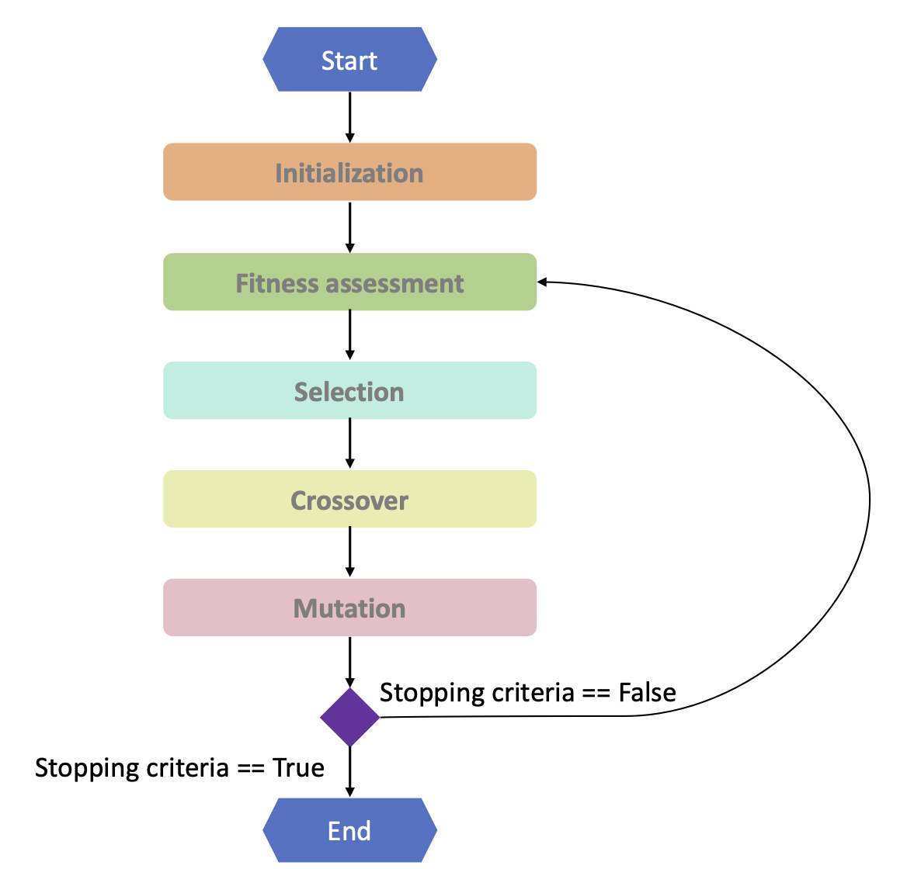

# parallel-and-distributed-GA-using-Iceland_Model
<h1>Table of content</h1>
<ul>
  <li><a href="#intro">Introduction</a></li>
  <li><a href="#steps">Steps</a></li>
   <li><a href="#structure">Structure</a></li>
   <li><a href="#main">Main Container</a></li>
   <li><a href="#simple">Simple Container</a></li>
   <li><a href="#jade">Jade Interface</a> </li>
  <li><a href="#conclusion">Conclusion</a></li>
</ul>
<h1 id="intro">Introduction</h1>

The island model is a concept in genetic algorithms that involves dividing the population into multiple subpopulations, also known as islands. Each island operates independently and evolves its own set of solutions through genetic operators such as selection, crossover, and mutation. Periodically, individuals from different islands migrate between them, allowing for information exchange and diversity preservation.

<h1 id="steps">Steps</h1>

The basic steps of a genetic algorithm are as follows:

<ul>
  <li><b>Initialization:</b>Start by creating an initial population of individuals (solutions) randomly or using some heuristic. Each individual is represented as a string of genes, which encodes a potential solution to the problem.</li>
  <li><b>Fitness Function:</b> Define a fitness function that evaluates how well each individual solves the problem at hand. The fitness function assigns a fitness value to each individual based on their performance. The higher the fitness value, the better the solution.</li>
  <li><b>Selection: </b>Select individuals from the population based on their fitness, which is a measure of how well they solve the problem. Fit individuals have a higher probability of being selected for the next steps. Common selection methods include roulette wheel selection, tournament selection, and rank-based selection.</li>
  <li><b> Reproduction (Crossover):</b> Create new offspring by combining genetic information from selected individuals through crossover. Crossover involves swapping or recombining genetic material (genes) between two parent individuals to create one or more offspring. This process mimics biological reproduction and introduces new variations into the population.</li>
  <li><b>Mutation: </b>Introduce random changes or mutations in the genetic material of individuals. Mutation helps explore new regions of the search space that may not be covered by crossover alone. It maintains diversity in the population and prevents premature convergence to suboptimal solutions.</li>
</ul>

These five phases—initial population, fitness function, selection, crossover, and mutation—are iteratively applied in each generation of the genetic algorithm. By repeating these steps, the algorithm explores the search space, promotes better solutions through selection and crossover, introduces variations through mutation, and converges towards optimal or near-optimal solutions to the problem.

<h1 id="structure">Structure</h1>

<h1 id ="main">Main Container</h1>

The provided code initializes and starts the main container in the JADE framework using the MainContainer class. Upon execution, the code creates an instance of the JADE runtime by invoking Runtime.instance(). This runtime instance is responsible for managing the execution of agents. The code then creates a ProfileImpl object and sets the Profile.GUI parameter to "true", enabling the graphical user interface for the main container. Next, the main container is created using the runtime instance and the profile. Finally, the start() method is called on the main container, initiating the execution of the JADE platform. This code serves as the entry point for the JADE application, creating the necessary infrastructure to support the execution of agents in a multi-agent system.

<h1 id="simple">Simple Container </h1>

<b>"SimpleContainer"</b>sets up a JADE platform to run a multi-agent system. It includes the necessary steps to create and configure the platform, as well as the initialization of agents. 
We creates multiple instances of an agent named "IslandAgent" and starts them within the agent container. The number of islands is determined by the constant value <b>"GAUtils.ISLAND_NUMBER"</b>  is set to 5, it means that the code will create and start 5 instances of the <b>"IslandAgent"</b> agent within the agent container. Each agent will be named "Island0", "Island1", "Island2", "Island3", and "Island4". 
  Finally, a single instance of the <b> "MasterAgent"</b> agent is created and started within the agent container. This agent will coordinate the activities of the island agents.

<h1 id ="jade">Jade Interface </h1>

<h1 id="conclusion">Conclusion</h1>

In conclusion, the Genetic Algorithm (GA) is a powerful optimization algorithm inspired by the principles of natural selection and genetics. It is used to solve complex problems by mimicking the process of evolution. GA operates on a population of individuals, representing potential solutions, and iteratively applies selection, crossover, and mutation operators to evolve and improve the solutions over generations. Through the use of a fitness function, GA can efficiently search for optimal or near-optimal solutions in large search spaces. 

Multi-Agent Systems (MAS) involve the coordination and interaction of multiple autonomous agents to achieve a common goal or solve a complex problem. MAS provide a decentralized and distributed approach to problem-solving, where agents can communicate, cooperate, and coordinate their actions to accomplish tasks that may be beyond the capabilities of individual agents. MAS enable parallel processing, fault tolerance, scalability, and adaptability in solving complex problems. 

The Island Model is a specific architecture or paradigm within the realm of multi-agent systems, commonly used in Genetic Algorithms. In the Island Model, the population of individuals is divided into multiple subpopulations or islands, each operating independently and evolving solutions within its domain. Periodically, selected individuals migrate between islands, allowing the exchange of genetic material and promoting diversity. The Island Model can enhance the exploration and exploitation capabilities of GA by maintaining diverse subpopulations and enabling the sharing of information across islands.

